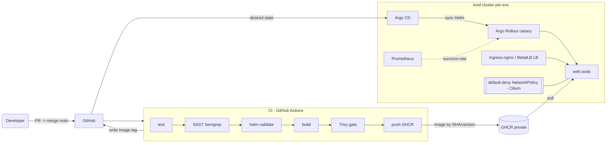

# DevSecOps Challenge — Containerized Node.js App on Kubernetes

A production-oriented, reproducible deployment of the sample Node.js app, with
**Infrastructure as Code**, a **security-gated CI pipeline**, **GitOps CD**, and
**progressive delivery**. Everything runs locally on `kind` so a reviewer can
reproduce it end-to-end with **no cloud account and no cost** — while the patterns
(reusable IaC modules, a parameterized Helm chart, digest-based promotion,
canary analysis) are the ones I'd use on a managed cloud cluster.

App source is a fork of [EladAviczer/sample-nodejs](https://github.com/EladAviczer/sample-nodejs),
vendored into [`app/`](app/) and extended with HTTP metrics + `/work` (HPA) and a
fault-injection switch (canary-abort demo).

---

## TL;DR — reproduce it

**Prereqs:** `docker`, `kind`, `kubectl`, `helm`, `terraform` (≥1.5), and the
Argo Rollouts kubectl plugin. *(macOS: `brew install kind kubectl helm terraform argoproj/tap/kubectl-argo-rollouts` + Docker Desktop.)*

```bash
make all ENV=dev     # terraform apply (cluster + addons) -> build -> kind load -> helm deploy -> smoke
curl -H "Host: web.dev.localtest.me" http://localhost/my-app     # {"msg":"Hello, World!","env":"dev",...}
make gitops ENV=dev  # hand CD to Argo CD (app-of-apps)
make down ENV=dev    # tear it all down
```

## Repository layout

```
app/                     Node.js app (/my-app,/about,/healthz,/readyz,/metrics,/work) + Dockerfile + tests
infra/
  modules/kind-cluster/  Reusable: a kind cluster wired for ingress (Cilium CNI)   <- swap for EKS/AKS/GKE
  modules/addons/        Reusable: Cilium, MetalLB, ingress-nginx, metrics-server,
                         Argo CD, Argo Rollouts, Prometheus (Helm)
  environments/{dev,staging,prod}/  Thin wiring + tfvars                            <- env-specific config
deploy/web/              Helm chart: Rollout (canary), stable/canary Services, Ingress,
                         HPA, PDB, ConfigMap, Secret, SA, default-deny NetworkPolicies,
                         AnalysisTemplate. values-{dev,staging,prod}.yaml overlays.
argocd/                  GitOps CD: AppProject + app-of-apps root + per-env Applications
.github/workflows/ci.yaml   test -> SAST(Semgrep) -> validate Helm -> build -> Trivy -> push -> git write-back
docs/                    architecture, governance, troubleshooting, DEMO (live evidence)
Makefile                 One-command local workflows
```

## Architecture



## Key decisions (and why)

- **Rollout (Argo Rollouts), not a plain Deployment.** The app is stateless, so a
  Deployment would suffice — but progressive delivery is the point. Canary
  `20% → Prometheus success-rate gate → 50% → 100%`, with **automatic abort** on a
  bad release. HPA owns replica count; the Rollout owns the release strategy.
- **Helm, parameterized per env.** The brief asks for a Helm chart. One chart,
  three `values-*.yaml` overlays (name/scale/config/image/host). Base is
  env-agnostic; nothing about dev leaks into prod.
- **IaC in reusable modules.** `modules/kind-cluster` is the cloud seam — replace
  it with an EKS/AKS/GKE module and `modules/addons` + the app are unchanged.
- **GitOps, separate concerns.** CI **builds, scans, pushes, and writes the image
  tag into git**; Argo CD **pulls** and reconciles. CI never has cluster
  credentials. dev auto-syncs; staging/prod are manual promotions (a git edit).
- **Cilium CNI.** kind's default CNI does not enforce NetworkPolicy; Cilium does,
  so the **default-deny** posture is real, not decorative. MetalLB gives the
  ingress a real `LoadBalancer` IP (the cloud pattern) while host-port 80 keeps
  `http://localhost` working for a browser.

## DevSecOps — how the brief's security asks are met

| Requirement | Implementation |
|---|---|
| **SAST, fail on critical** | Semgrep (`p/security-audit`,`p/nodejs`,`p/owasp-top-ten`) with `--error` → pipeline fails on any ERROR finding |
| **Image scan, block on high** | Trivy `--severity HIGH,CRITICAL --exit-code 1` **before** push/deploy → a vulnerable image never reaches the cluster |
| **Build & dockerize** | Multi-stage Buildx image, **distroless/Chainguard** base, non-root uid 65532, read-only rootfs, dropped caps, seccomp `RuntimeDefault` |
| **Private registry** | GHCR (private), pushed by immutable `sha-<sha>` + semver tags |
| **Version bumping / git workflow** | GitHub Flow; semver from tags (`#minor`/`#major`/`feat:`); each release tags git + writes the image tag back for GitOps |
| **Deploy to K8s** | Argo CD app-of-apps, Helm-rendered |
| **ArgoCD & GitOps** | App repo = source of truth Argo reconciles; write-back tag bump (Argo Image Updater is the cloud alternative) |

Additional hardening: SHA-pinned GitHub Actions, no secrets in git, dedicated
ServiceAccount with token automount disabled, PDB, topology spread, startup probe,
`[skip ci]` guard against loops.

## Health & probes

`/healthz` (liveness/startup), `/readyz` (readiness), `/metrics` (Prometheus:
`http_requests_total`, latency histogram, default process metrics). `/work?ms=N`
burns CPU to exercise the HPA; `FAIL_RATE` injects 5xx on `/classified` to prove
the canary aborts.

See [docs/architecture.md](docs/architecture.md), [docs/governance.md](docs/governance.md),
[docs/troubleshooting.md](docs/troubleshooting.md), and live evidence in
[docs/DEMO.md](docs/DEMO.md).
