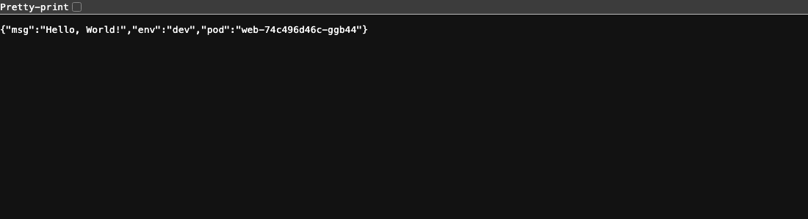

# Demo — live evidence

Brought up end-to-end on a real `kind` cluster (`rafael-dev`) on 2026-09-29.
Commands: `make all ENV=dev` (Terraform) → `make gitops` (Argo CD). All output below
is from the running cluster.

## 1. Infrastructure (Terraform)

`terraform apply` → **10 resources**: kind cluster (2 nodes) + Cilium (CNI) +
MetalLB + ingress-nginx + metrics-server + Argo CD + Argo Rollouts + Prometheus.

```
$ kubectl get nodes
rafael-dev-control-plane   Ready   control-plane   v1.30.4
rafael-dev-worker          Ready   <none>          v1.30.4
$ kubectl -n kube-system get ds cilium -o jsonpath='{.status.numberReady}'   # 2/2 ready
```

## 2. GitOps CD (Argo CD app-of-apps)

```
$ kubectl -n argocd get applications
NAME          SYNC STATUS   HEALTH STATUS
root          Synced        Healthy
web-dev       Synced        Healthy
web-prod      OutOfSync     Missing     # manual promotion (by design)
web-staging   OutOfSync     Missing     # manual promotion (by design)
```

## 3. App reachable through the Ingress



```
$ curl -H "Host: web.dev.localtest.me" http://localhost:8080/my-app
{"msg":"Hello, World!","env":"dev","pod":"web-74c496d46c-ggb44"}
```
(MetalLB also assigns a real LoadBalancer IP — `172.18.255.200`; reachable from
inside the kind network. `localhost` uses a port-forward because Cilium doesn't
wire hostPort by default.)

## 4. NetworkPolicy enforced by Cilium (default-deny)

```
$ kubectl -n web-dev exec np-test -- nslookup example.com     # DNS egress:    OK (allowed)
$ kubectl -n web-dev exec np-test -- curl --max-time 5 https://example.com
                                                              # external TCP:  BLOCKED
```
DNS is the only permitted egress; ingress is allowed only from `ingress-nginx`
and `monitoring`. The deny is real, not decorative.

## 5. Progressive delivery — canary PROMOTE (Prometheus-gated)

Merged `dev -> v0.0.2`. Argo synced; the Rollout ran the canary with live traffic:

```
Strategy: Canary   Step 2/6   SetWeight 20   ActualWeight 20
Images:   v0.0.1 (stable)   v0.0.2 (canary)
└─ revision:2  web-f78d9c7d4 (canary)
   └─ α web-f78d9c7d4-2-2  AnalysisRun  Running  ✔ 1
```
→ `AnalysisRunSuccessful` → step 20% → **50% → 100%** → `v0.0.2 (stable)`.
Analysis: `web-f78d9c7d4-2-2  Successful`.

## 6. Progressive delivery — canary ABORT (bad release)

Merged `dev -> v0.0.3` with `FAIL_RATE=1` (injects 5xx), drove load at the
failing path. The canary started at 20%, the success-rate metric breached the
threshold, and the Rollout **aborted automatically**:

```
Status:  ✖ Degraded
Message: RolloutAborted: aborted update to revision 3:
         Metric "success-rate" assessed Failed due to failed (2) > failureLimit (1)
Images:  v0.0.2 (stable)   v0.0.3 (canary, rolled back to weight 0)

$ kubectl -n web-dev get analysisrun
web-f78d9c7d4-2-2   Successful   # v0.0.2 promote
web-865cd74997-3-2  Failed       # v0.0.3 abort

# app kept serving from stable throughout — zero user impact:
$ curl -H "Host: web.dev.localtest.me" .../my-app   -> {"msg":"Hello, World!",...}
```
Then rolled back via GitOps (`[skip ci]`) → Rollout **Healthy** on `v0.0.2`.

## 7. Security-gated CI

`ci` workflow green on every push: `test` → `sast` (Semgrep, `--error`) →
`validate-manifests` (helm template dev/staging/prod) → build → **Trivy
HIGH/CRITICAL gate** → push to private GHCR by `vX.Y.Z` + `sha-<sha>`, then git
tag write-back to `values-dev.yaml`. Actions are SHA-pinned.

> The blocking gates earn their keep: an earlier iteration of this app failed the
> Trivy gate on a real HIGH CVE in `path-to-regexp` (pinned to 0.1.13) and on an
> unpatched OpenSSL CVE in the distroless base (switched to a Chainguard base),
> and Semgrep blocked a `curl | sh` in the workflow. Each was fixed, not suppressed.

## Reproduce
```bash
make all ENV=dev && make gitops ENV=dev
make down ENV=dev
```
