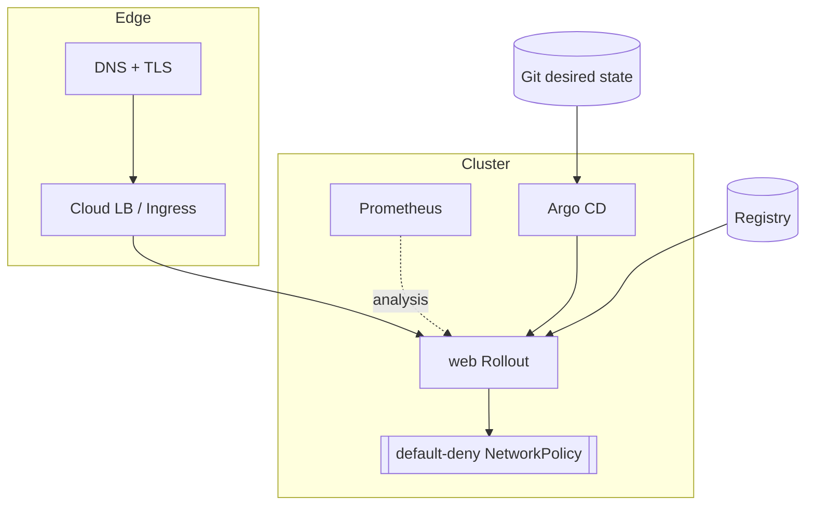

# Architecture

## This repo (local, kind)

- **IaC** — Terraform, split into reusable modules (`kind-cluster`, `addons`) and
  thin per-env wiring. `terraform apply` stands up: kind cluster → Cilium (CNI) →
  MetalLB (LoadBalancer) → ingress-nginx → metrics-server → Argo CD → Argo
  Rollouts → Prometheus.
- **App** — Node/Express, non-root distroless image, health/ready/startup probes,
  HPA + PDB + topology spread, deployed as an Argo Rollouts `Rollout`.
- **Networking** — Cilium enforces **default-deny**; only DNS egress and
  ingress from the ingress controller + Prometheus are allowed. MetalLB gives the
  ingress a real external IP.
- **CD** — Argo CD app-of-apps reconciles the Helm chart from git; dev auto-syncs,
  staging/prod are manual promotions.
- **Progressive delivery** — canary 20% → Prometheus success-rate gate → 50% →
  100%, auto-abort on regression.

## Mapping to a cloud production target

The `modules/kind-cluster` boundary is the seam. Swapping it for a managed-cluster
module (EKS/AKS/GKE) leaves `modules/addons`, the Helm chart, and the GitOps
layer unchanged. In the cloud you'd additionally: use a managed ingress + real
DNS/TLS (cert-manager + external-dns), per-env remote Terraform state
(`backend.tf.example`), a hardened registry (ECR/GAR) with an OIDC-federated
push identity, and Argo Image Updater for tag write-back. The security posture
(non-root, read-only rootfs, default-deny netpol, scanned+pinned images, SAST/DAST
gates) carries over verbatim.

